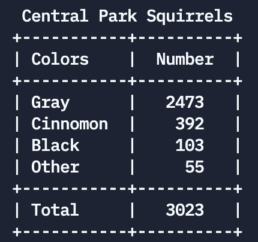

# Central Park Squirrels Analysis
An awk script to analyze the number of squirrels in Central Park and their respective colors using the [dataset](https://data.cityofnewyork.us/Environment/2018-Central-Park-Squirrel-Census-Squirrel-Data/vfnx-vebw) published by NYC Open Data. 

## Motivation
Inspired by the [article](https://www.bloomberg.com/news/articles/2019-06-24/how-many-squirrels-are-in-nyc-s-central-park) written by Linda Poon and the R4DS Online Learning Community's [GitHub repository](https://github.com/rfordatascience/tidytuesday/tree/master/data/2019/2019-10-29) for their #TidyTuesday event.

## Installation
### Dependencies
- Make
- wget

### Instructions
1. Clone this Github repository
```bash
git clone https://github.com/seanyap/squirrels-analysis.git
```
2. Run the prepared Makefile
```bash
make
```

## Report
Below is a screenshort of the report generated by the script




